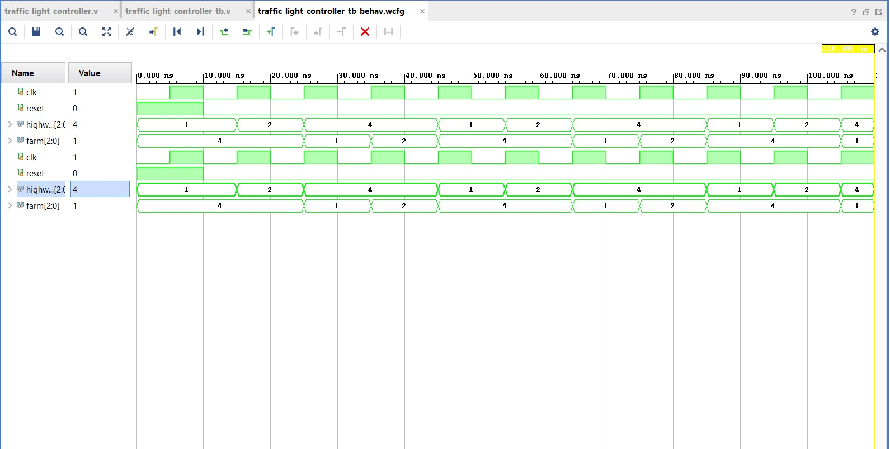

# Traffic Light Controller using Verilog

This project implements a Traffic Light Controller using Verilog HDL.  
A Finite State Machine (FSM) controls the traffic signals for a highway and a farm road.

## Features
- Verilog RTL design
- FSM-based traffic control
- Green → Yellow → Red sequencing
- Simulation performed using Vivado

## Files
- `traffic_light_controller.v` : Verilog design module
- `traffic_light_controller_tb.v` : Testbench for simulation
- `traffic_light_waveform.jpeg` : Simulation waveform output

## Simulation Waveform

